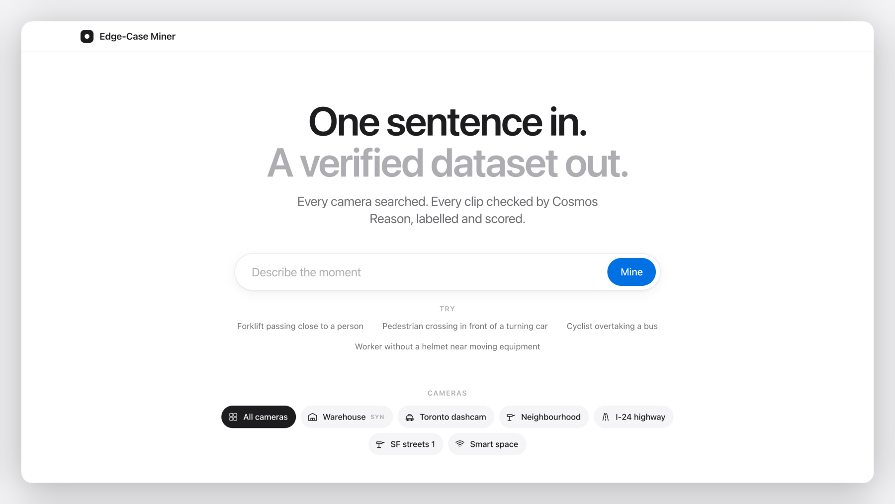
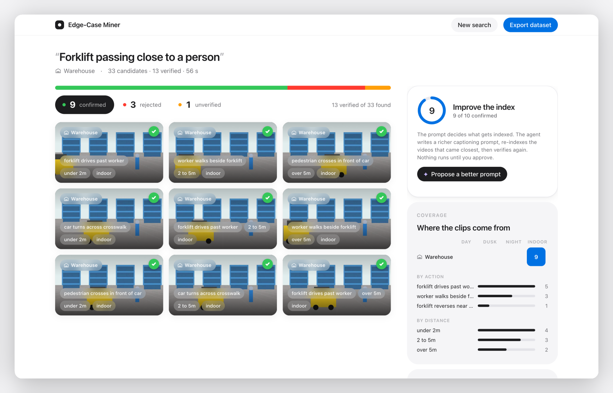
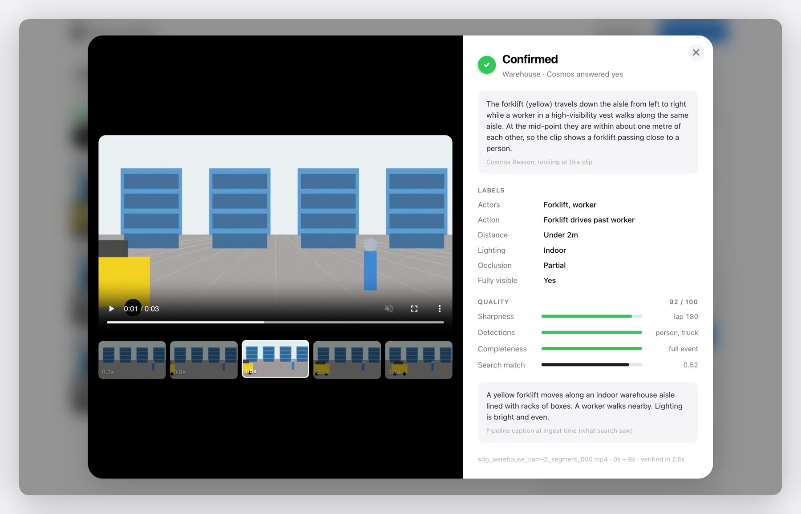
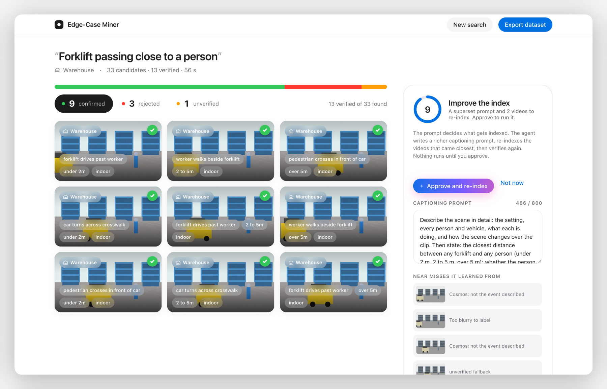
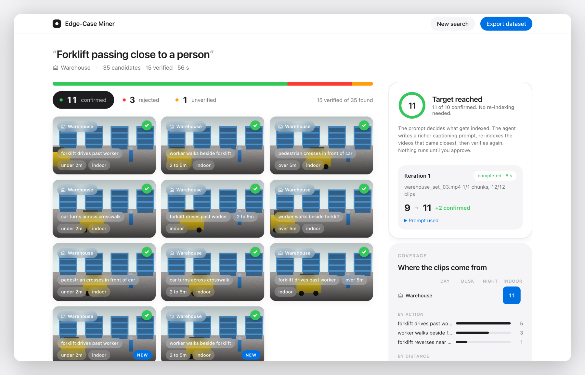

<h1 align="center">Edge-Case Miner</h1>

<p align="center"><b>One sentence in. A verified dataset out.</b><br>
Describe the moment you need footage of. Every camera is searched, every clip is checked by Cosmos Reason, labelled, scored and exported, with a list of what you still need to film.</p>

<p align="center"></p>

<p align="center">Built at the VAST Builders Challenge (Real-Time Video Agents Hack, San Francisco) on the organisers' video pipeline.</p>

<br>

## The problem

Robotics and autonomous-driving teams have hours of footage and no time to label it. The rare moments that matter, a forklift brushing past a worker, a pedestrian stepping out in front of a turning car, are buried in archives nobody can watch. Search finds look-alikes. Nobody checks them.

## What it does

**Search.** Your sentence becomes a query over every indexed camera.

**Verify.** Each candidate clip is shown to Cosmos Reason with a yes/no question about what it actually shows. The same call extracts labels: actors, action, distance class, lighting, weather, occlusion, whether the event is fully visible. A clip the model cannot answer for is never confirmed.

**Score.** YOLO11 detections, blur and completeness. Weak clips are rejected with a reason.

**Report and export.** Coverage by camera and lighting, the gaps, a next-collection plan, and a zip with `manifest.json`, `labels.csv`, the clips and a dataset card.

**Improve the index.** The prompt decides what gets indexed. When too few clips pass, the agent writes a richer captioning prompt, picks the videos that came closest, and after you approve, re-indexes them through the pipeline and verifies again.

<br>

<p align="center"></p>
<p align="center"><sub>Hover a clip to play it. Confirmed, rejected and unverified are one tap apart.</sub></p>

<br>

<p align="center"></p>
<p align="center"><sub>Verification is real. Cosmos Reason's reasoning, the labels it extracted, and the quality meters, next to the clip and its filmstrip.</sub></p>

<br>

<p align="center"></p>
<p align="center"><sub>Nine of ten. The agent proposes a superset prompt and two videos to re-index. Nothing runs until you approve.</sub></p>

<br>

<p align="center"></p>
<p align="center"><sub>One iteration later: 9 → 11 confirmed, new clips badged, target reached.</sub></p>

<p align="center"><sub>Screenshots are from the offline preview (<code>tests/preview_ui.py</code>) with synthetic clips. Live timings are in <a href="NOTES.md">NOTES.md</a>.</sub></p>

<br>

## Run it

```bash
pip install -r requirements.txt

python -m edgecase health                                  # backend, models, indexed counts
python -m edgecase serve                                   # web UI on http://127.0.0.1:8000
python -m edgecase mine "forklift near a person" --groups warehouse --export
python -m edgecase mine "pedestrian near a vehicle" --groups pie --verify 8 --loop
```

On the hackathon VM the team variables are already in the environment; otherwise the tool reads the single `/config/<team>.config`. A re-index starts only from `--loop` or the web UI's **Approve and re-index**, and both ask first.

Offline, with no credentials: `python -m pytest tests -q` runs the whole flow against a mock stack, and `python tests/preview_ui.py warehouse` serves the UI with synthetic clips on port 8765.

## How it is built

```
request → llm.py (plan) → vss_client.py (search per camera)
        → verify.py (Cosmos Reason on the clip, cached) → quality.py (YOLO sidecar, blur, completeness)
        → report.py (coverage, gaps, plan) → export.py (dataset zip)
                 ↑                                   │
                 └── loop.py (new prompt, approved re-index, search again) ←┘
```

| Piece | Used for |
|---|---|
| VSS retrieval API | candidates, clips, detections, camera groups |
| VSS `/dashboard/reingest` | the improve-the-index loop |
| Cosmos Reason | clip verification and label extraction |
| Cosmos Embed1 | hybrid search, through the backend |
| YOLO11 | detection sidecars for the quality score |
| W&B serverless inference | query planning, ingestion prompts, gap reports |
| FastAPI + one HTML page | the UI |

Guardrails: at most 20 Cosmos verifications per query, two at a time, 60 s timeout, one retry, answers cached on disk. Re-index prompts are always a superset (general scene first, then the fields the request needs), at most two chunks and two iterations per run, every run logged to `reingest_log.jsonl`.

Measured on the live stack: search 2.5 to 11 s, verification about 2.5 to 3 s per clip, a 20-clip pass about one minute, one loop iteration 78 s.

## Organisers' guides

[BEFORE_YOU_BUILD.md](BEFORE_YOU_BUILD.md) · [BUILD_DAY.md](BUILD_DAY.md) · [ARCHITECTURE_REFERENCE.md](ARCHITECTURE_REFERENCE.md) · skills under `.cursor/skills/`
