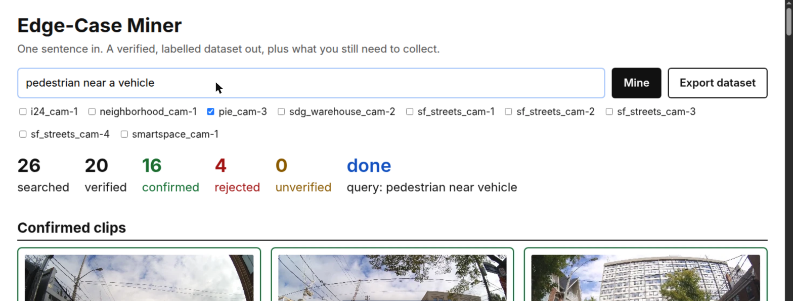
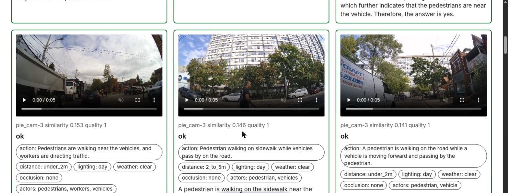
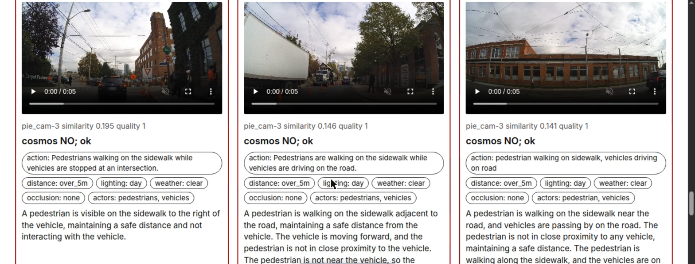
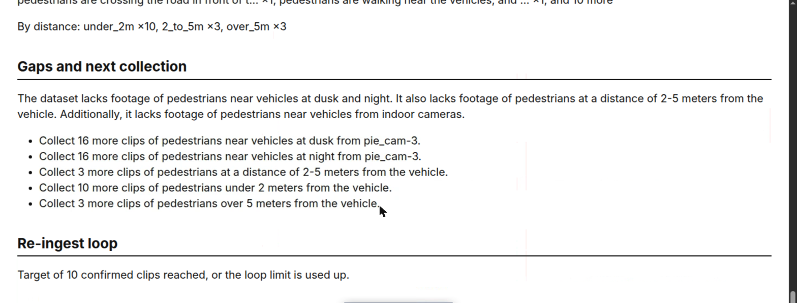

# Edge-Case Miner

One sentence in. A verified, labelled training dataset out, plus the list of what you still need
to collect.

Robotics and autonomous-driving teams have hours of footage and no time to label it. Edge-Case
Miner takes a plain-English request such as "forklift passing close to a person" and mines an
indexed video archive for it. Built at the VAST Builders Challenge (Real-Time Video Agents Hack,
San Francisco) on top of the organisers' prebuilt video pipeline.

## What it does

1. **Search.** An LLM turns the request into a search query and picks camera groups. Hybrid search
   runs over the whole archive, or once per chosen camera group.
2. **Verify.** Each candidate clip is downloaded and shown to Cosmos3-Reason with a yes/no question.
   The same call extracts labels: actors, action, distance class, lighting, weather, occlusion,
   and whether the event is fully visible. A clip the model cannot answer for is marked
   "unverified", never confirmed.
3. **Score.** Quality from 0 to 1 from YOLO11 detections, blur (Laplacian variance on three frames)
   and event completeness. Bad clips are rejected with a reason.
4. **Report.** Coverage of confirmed clips by camera group and lighting, by action and by distance,
   then a gap report and a next-collection plan.
5. **Export.** `manifest.json`, `labels.csv`, `clips/` and a dataset card, zipped.
6. **Re-ingest loop.** If too few clips pass, the agent writes a better ingestion prompt (a
   superset: general description first, then the fields the request needs), picks the one or two
   chunks that came closest, and after a human approves, re-ingests them through the pipeline and
   searches and verifies again. At most two iterations. Every re-ingest is logged in
   `reingest_log.jsonl`.

## Screenshots (live run, Toronto dashcam, "pedestrian near a vehicle")









## Architecture

```
request -> llm.py (plan) -> vss_client.py (search per camera group)
        -> verify.py (Cosmos3-Reason on the clip, cached) -> quality.py (YOLO sidecar, blur, completeness)
        -> report.py (coverage, gaps, plan) -> export.py (dataset zip)
                 ^                                   |
                 +---- loop.py (new prompt, approved re-ingest, search again) <--+
```

| Piece | Used for |
|---|---|
| VSS retrieval API (`/search`, `/videos/*`, `/metadata/*`) | candidates, clips, detections, camera groups |
| VSS `/dashboard/reingest` | the re-ingest loop |
| Cosmos3-Reason | clip verification and label extraction |
| Cosmos Embed1 | hybrid search (through the backend) |
| YOLO11 | detection sidecars for the quality score |
| W&B serverless inference | query planning, ingestion prompts, gap reports |
| FastAPI, plain HTML | web UI |

Skills used as the API reference: `retrieval/login`, `retrieval/search`, `retrieval/videos`,
`retrieval/list-metadata`, `retrieval/dashboard`, `ingest/reingest-videos`, `gpu/*`, `submission`.

## Run it

On the hackathon VM the team variables are already in the environment. If they are not, the tool
reads the single `/config/<team>.config` itself.

```bash
pip install -r requirements.txt

python -m edgecase health                   # backend, models, indexed counts
python -m edgecase mine "forklift near a person" --groups warehouse --export
python -m edgecase mine "pedestrian near a vehicle" --groups pie --verify 8 --loop
python -m edgecase serve                     # web UI on http://127.0.0.1:8000
```

`--loop` and the web UI's "Approve and re-ingest" button are the only ways a re-ingest starts, and
both ask first. Set `WANDB_MODEL` to change the W&B model (default
`meta-llama/Llama-3.1-8B-Instruct`).

Limits: at most 20 Cosmos verifications per query, two at a time, 60 second timeout, one retry.
Answers are cached on disk by clip and question.

Measured on the live stack: search 2.5 to 11 s, Cosmos verification about 2.5 to 3 s per clip, a
20-clip pass about one minute, one re-ingest loop iteration (two chunks) 78 s. See [NOTES.md](NOTES.md).

## Tests

`python -m pytest tests -q` runs the whole flow, including the loop and export, against a mock of
the stack (`tests/mock_stack.py`). It needs no credentials.

## Organisers' guides

[BEFORE_YOU_BUILD.md](BEFORE_YOU_BUILD.md), [BUILD_DAY.md](BUILD_DAY.md),
[ARCHITECTURE_REFERENCE.md](ARCHITECTURE_REFERENCE.md), and the skills under `.cursor/skills/`.
